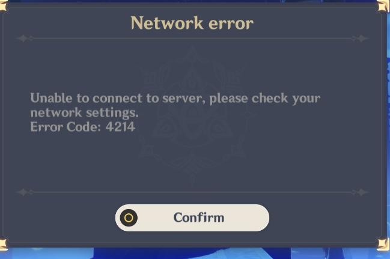
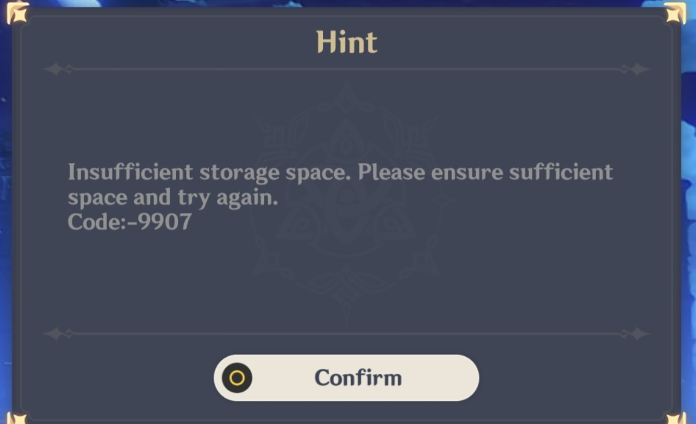

import { Callout } from 'nextra-theme-docs'

# Troubleshooting

## Error 4214
### "Unable to connect to server. Please check your network settings."

To fix this, you must download the [patched UserAssembly](https://drive.yuuki.me/api/public/dl/ZOrLF1E5/GenshinImpact/Data/PC/3.2.0/Global/Patch/UserAssembly-patched.dll).

Rename the original UserAssembly.dll file to UserAssembly.dll.bak and put in the patched one.

Rename the patched UserAssembly from "UserAssembly-patched.dll" to "UserAssembly.dll"

## Error -9907
### "Insufficient storage space. Please ensure sufficient space and try again."

<Callout type="info" emoji="🤡">
    This error is only common in mobile devices
</Callout>

Fix by:\
Getting more storage. 💀🤓