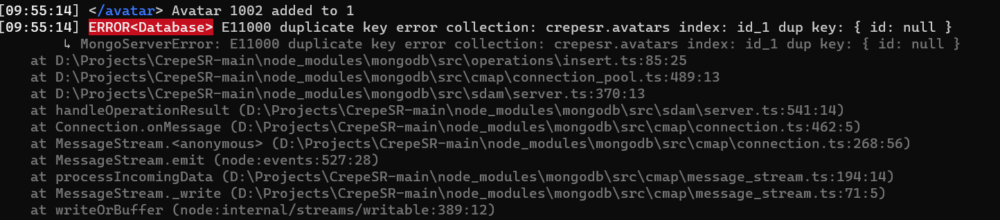
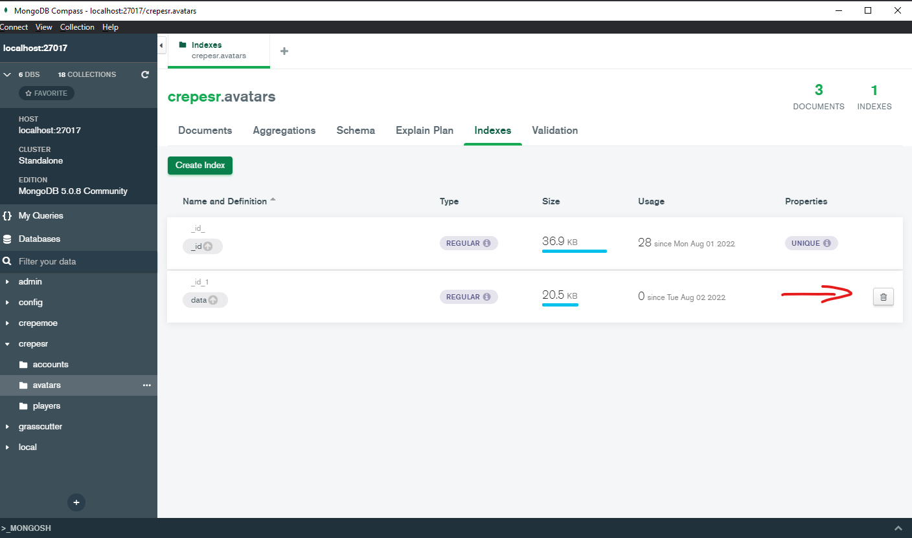
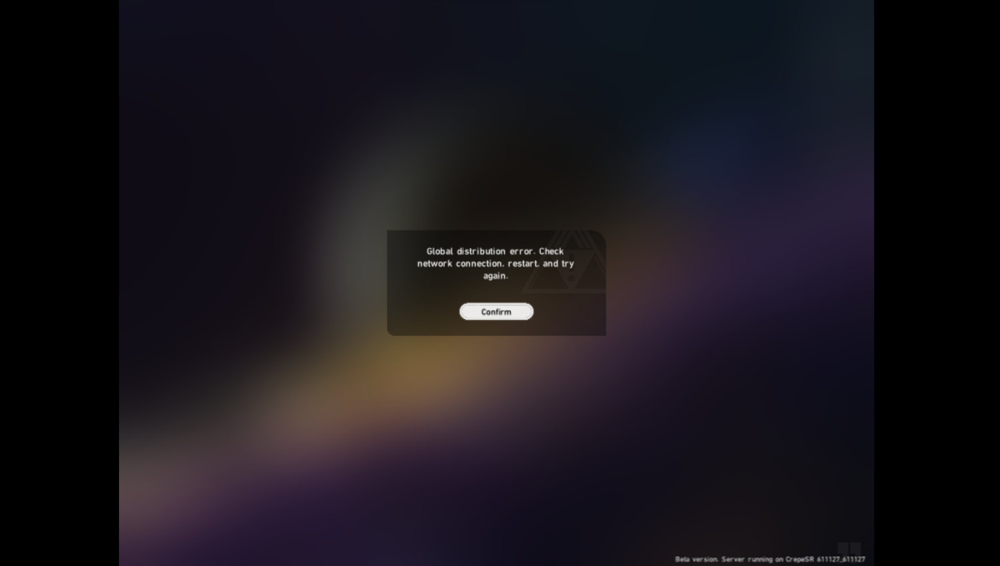

import Callout from 'nextra-theme-docs/callout'
import Image from 'next/image'

# Troubleshooting

## E11000 Duplicate Key Error Collection

Open MongoDBCompass, connect to localhost, go to the document indexes and press the delete button. Then retry.



## Global Distribution Error

MongoDB needs to be running and you need to be connected to MongoDB Compass.\
Also, you need the C++ plugin for Visual Studio
## EREFUSEDCONNECT (MongoDB Compass)

You need to start the MongoDB service.
```bash
/net start MongoDB
```